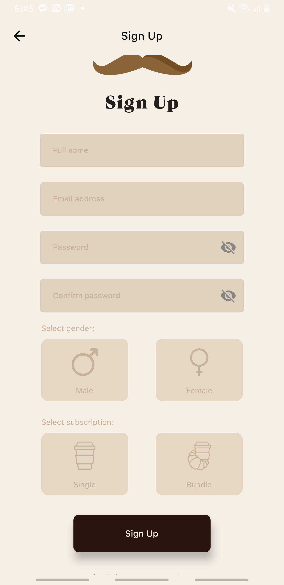
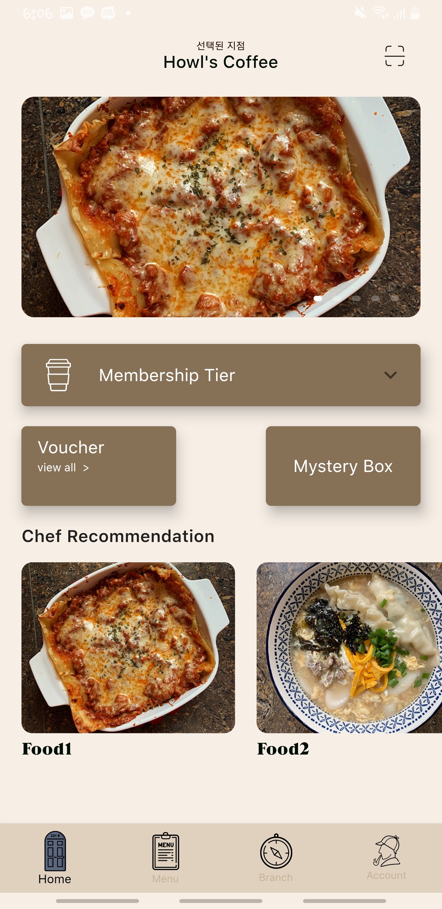
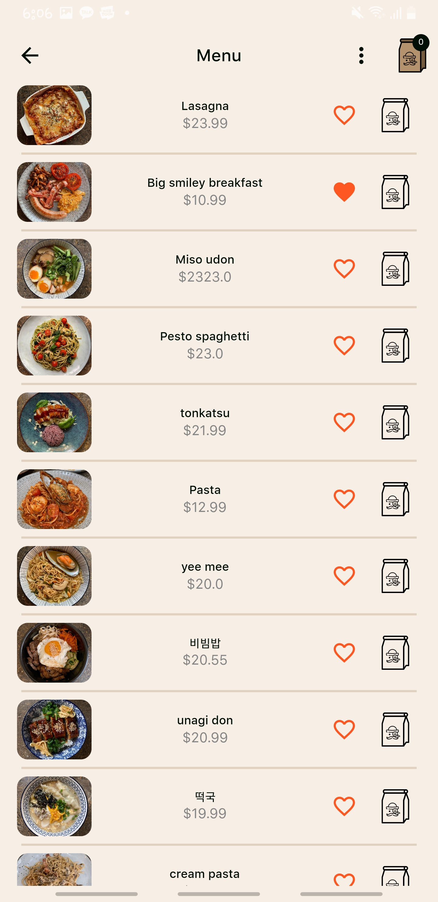
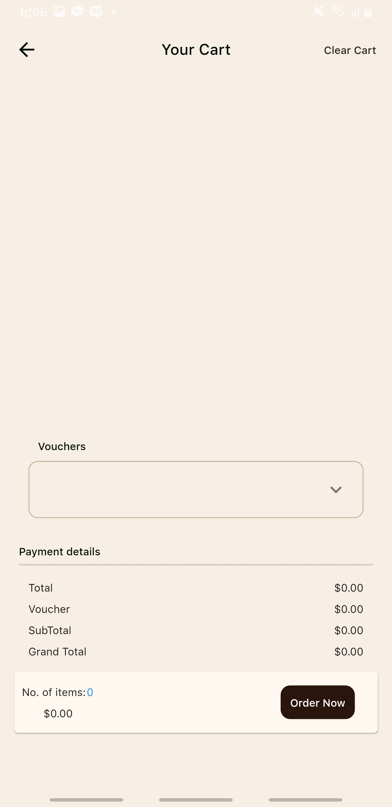
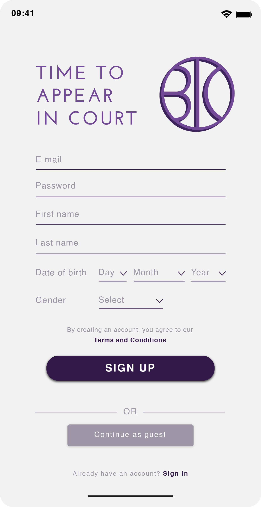
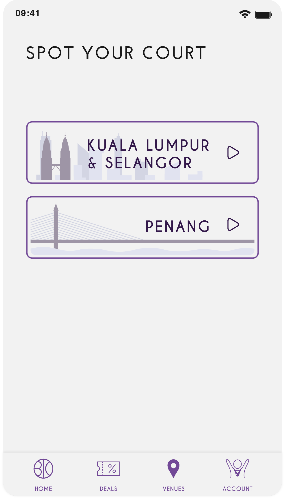
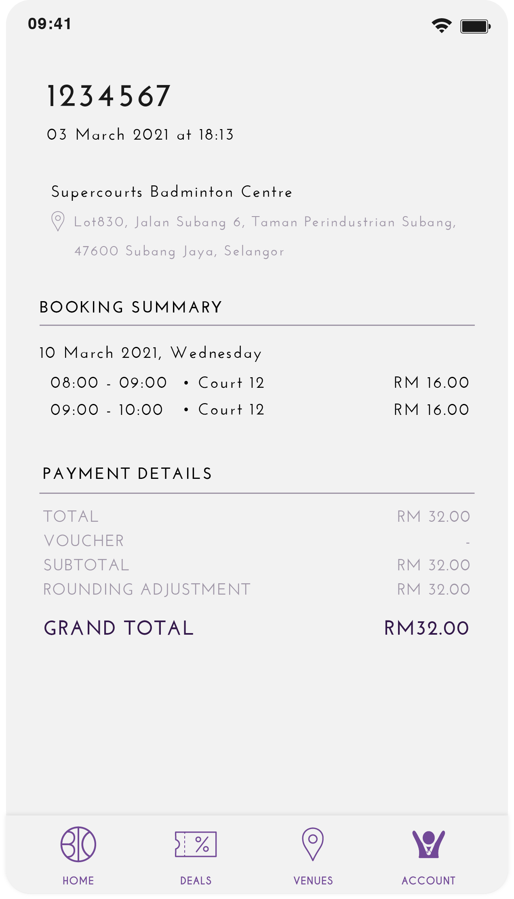
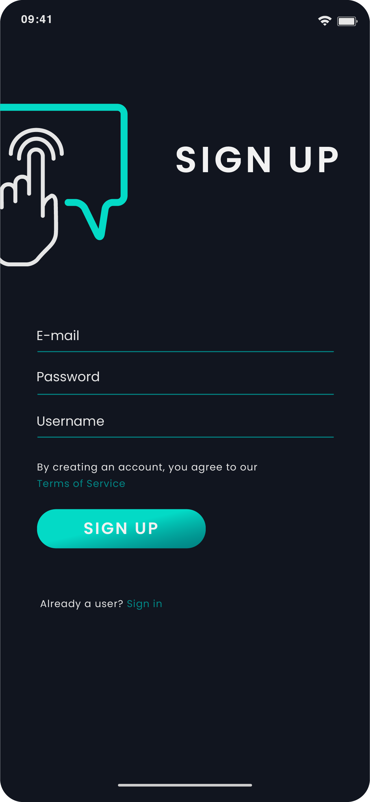
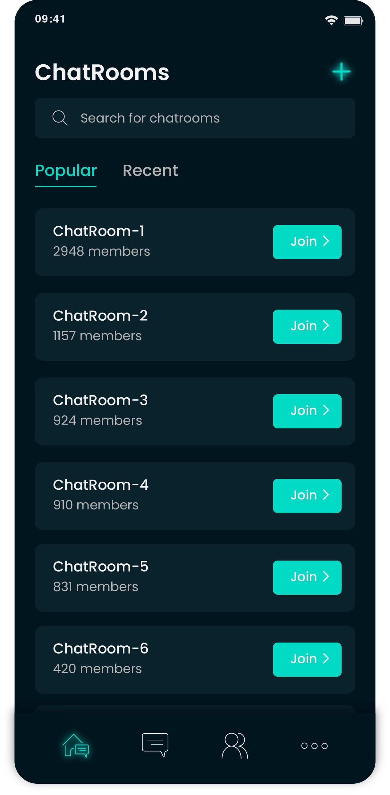
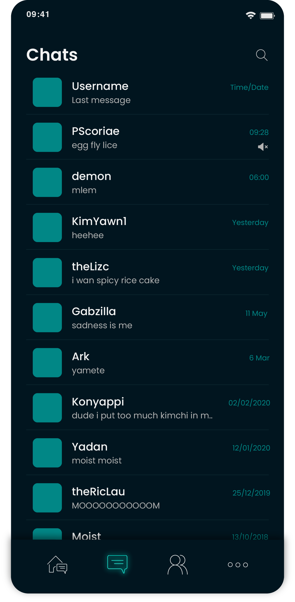

# Personal Projects
A Repo shared between Kim Yeon Wan and Chea Wern Yen.
This Repo contains all of our shared projects.

# 1. Boat Race Game
### Introduction
Our first shared project is a Boat Race game and was initially intended for a university assignment. However, we decided to implement GUI to improve its appearance and make it more interesting.  
* This game involves two players in their respective boats, who will race to the end of the river using a dice roll.  
* This game was developed using Java, and the GUI libraries used were JavaFx and Swing.  
* All illustrations were designed using Adobe Illustrator.

   

   


### Getting Started:
The following instructions will allow you to obtain an executable copy of the project on your local machine for development and testing purposes. See _Installation_ for notes on how to deploy the project on a live system.

#### Prerequisites
JavaFx was used in this project. Additional steps are required to install JavaFx for Java versions above JDK 8.

#### Installation
```
1.  JDK 8
	1. Go to https://gluonhq.com/products/javafx/ to download JavaFx, preferably Long Term Support(LTS).
	2. After downloading the zip file, extract the files into a folder in your drive.
	3. Go to environment variables to add the path of the folder to the system variable.
	4. You are good to go!

2. For DB visualizing
	1. Go to "sqliteJDBC" folder
	2. Also, go to [sqlite browser]-(https://sqlitebrowser.org/dl/)
	3. Download according to your system requirements.
	4. Run the sqlite browser.
	5. Click on the open database. Then, go to the src directory in the project folder and select the database from there.
	6. From there, you will have access to the data.
```


### Testing
Tests were conducted multiple times with a different set of users.


### Version
```
The Java version for this project was Coretto 11.
```

# 2. Café food ordering mobile application
### Introduction
This was our first mobile application for a café in South Korea.
* This mobile application was developed using Flutter.  
* The illustrations, layouts and storyboard were designed using Adobe Illustrator.  

Main features:
1. Sign up and login.  
   All users can view the menu. However, only registered users can add items to their cart and checkout.
2. View menu items and add/remove them from cart.
3. Apply voucher to the cart.  


\*Code cannot be disclosed.

 
   


# 3. Sports court booking mobile application
### Introduction
This was developed for a startup in Malaysia.  
* This mobile application was developed using Flutter.  
* The illustrations, layouts and storyboard were designed using Adobe Illustrator.  

Main features:
1. Sign up and login.  
   All users can view the venues and court availability. However, only registered users can proceed with booking.
2. Select timing and venue for booking.
3. Apply voucher code to the booking cart.

\*Code cannot be disclosed.

 
   

# 4. Chatting mobile application
### Introduction
This is our own personal project.
* This mobile application was developed using Flutter.  
* The illustrations, layouts and storyboard were designed using Adobe Illustrator.

\*Code cannot be disclosed.

 
   


## Authors

* **Kim Yeon Wan** - *Initial work* - [Yadan](https://github.com/wanyeonkim)
* **Chea Wern Yen** - *Initial work & UI/UX Design* - [Lisa Chea](https://github.com/lisacheawy)


## License
This project is licensed under the MIT License - see the [LICENSE.md](https://github.com/wanyeonkim/ToiletRoll/blob/main/LICENSE) file for details

## Acknowledgments

* Thank you stackoverflow you helped me alot
